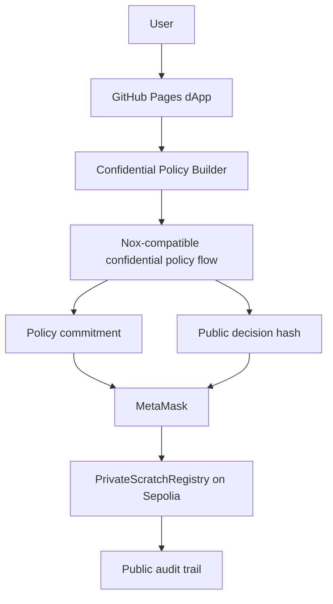

# Architecture

## Private fields

- bankroll
- max trade size
- max daily loss
- risk mode
- minimum net edge
- claim safety flag

## Public fields

- encrypted policy hash / commitment
- decision hash
- decision type
- risk tier
- report URI
